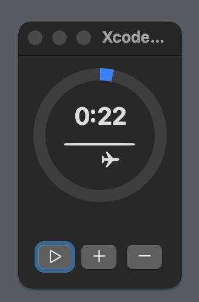
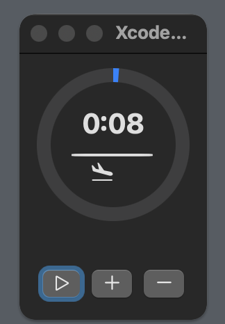

10초 증감 타이머
=============




- 좌표이동 애니메이션 용 아이콘 : airplane
- 종료임박 애니메이션 용 아이콘 : airplane.arrival

- 1초에 한번씩 x좌표 값이 1만큼 변경
- 남은 시간이 10초 이하일 시, airplane.arrival로 바뀜


## 상태

```swift
@State private var animeIconPositionX: CGFloat = -20 // 1
@State private var animeIconName: String = "airplane" // 2
```
1. Animation의X좌표용 상태 :  X좌표값은 -20 ~ +20
2. systenName 이름 변경용 상태 : airplane, airplane.arrival 


## 변수

```swift
private let MAX_TIME = 1 * 60 // 1
private let MIN_TIME = 0 // 2
private let TIMER_VALUE = 10 // 3
```

1. 타이머의 최대치
2. 타이머의 최소치
3. 타이머의 증가감 수치


## 함수

```swift
// 1
func plusButtonActionCheckMaxTime() {
        if(timeRemaining > MAX_TIME - TIMER_VALUE) {
            timeRemaining = MAX_TIME
        } else {
            timeRemaining += TIMER_VALUE
        }
        animeIconName = "airplane"
        animeIconPositionX = -20
    }
```
1. 플러스 버튼 액션
 - timeRemaining의 값이 최대치 이상으로 올라가지 않도록 방지
 - TIMER_VALUE(증가감 수치)의 값 만큼 timeRemaining의 값이 변경되도록 실행
 - 버튼 클릭과 타이머의 시작 및 종료 때, 비행기 위치 초기화

```swift
// 2
func minusButtonActionCheckMinTime() {
        if(timeRemaining < (MIN_TIME + TIMER_VALUE)) {
            timeRemaining = MIN_TIME
            print("Minus Button : \(timeRemaining)")
        } else {
            timeRemaining -= TIMER_VALUE
        }
        animeIconName = "airplane"
        animeIconPositionX = -20
    }
```

2. 마이너스 버튼 액션
 - timeRemaining의 값이 최소치 이하로 내려가지 않도록 방지
 - TIMER_VALUE(증가감 수치)의 값 만큼 timeRemaining의 값이 변경되도록 실행
 - 버튼 클릭과 타이머의 시작 및 종료 때, 비행기 위치 초기화


```swift
// 3
func timerAction() {
    if isRunning && timeRemaining > 0 {
        timeRemaining -= 1
        if timeRemaining <= 10 {
            NSSound.beep()
            animeIconName = "airplane.arrival"
            print("Receive : \(timeRemaining)")
            
        }
        
        animeIconPositionX += 2
        
        if animeIconPositionX >= 20 {
            animeIconName = "airplane"
            animeIconPositionX = -20
        }
    } else if isRunning {
        isRunning = false
        animeIconName = "airplane"
        animeIconPositionX = -20
    }
}
```
3. 타이머 액션
 - 10초 이하일때, bepp음 및 비행기 아이콘을 .arrival로 변경
 - 버튼 클릭과 타이머의 시작 및 종료 때, 비행기 위치 초기화


## 뷰
```swift
// 1
Image(systemName: animeIconName)
    .offset(x: animeIconPositionX, y: 0)
    .animation(.linear(duration: 1.5), value: animeIconPositionX)
```

1. 이미지 애니메이션
 - 비행기가 좌에서 우로 이동
 - 리니어, 속도 1.5초


